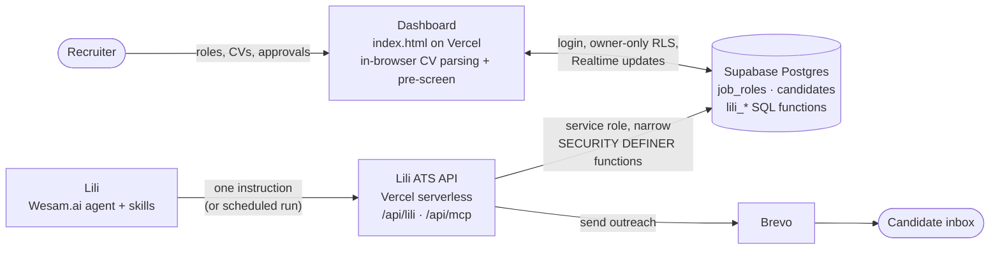

<div align="center">

# TalentScout AI · Meet Lili

**An autonomous AI technical recruiter for startups and small recruiting teams.**
Lili screens every CV, explains every score, and replies to every candidate, on a $0/month stack.

[](https://drive.google.com/file/d/17_2I2OlNHWvJzR-4_IhUwPJeL-r4SncT/view?usp=sharing)
[](https://lili-hr-agent.vercel.app)
[](https://wesam.ai)
[](https://supabase.com)

*Agents at Work Hackathon · 1st Edition · Built by Laila Mohamed Fikry*

</div>

---

## 🎬 Demo

**[▶ Watch the 2-minute demo video](https://drive.google.com/file/d/17_2I2OlNHWvJzR-4_IhUwPJeL-r4SncT/view?usp=sharing)**

In the video, 4 CVs are bulk-imported and queued. Lili picks them up on her own after one instruction, scores each against the role's rubric with cited evidence, writes a personal invite or constructive rejection for each, and her verdicts appear on the dashboard live. An interview invite then arrives in a real inbox via Brevo.

**Try it yourself:** [lili-hr-agent.vercel.app](https://lili-hr-agent.vercel.app). See [How to test it](#-how-to-test-it).

---

## 🎯 The problem

Small tech companies and boutique recruiting agencies hire like big companies, without a recruiting team:

- **Every role gets 50–200 CVs,** and a founder or office manager screens them on top of their real job. That's about 20 minutes per candidate to read, score, and reply.
- **Screening is inconsistent.** Gut feel, spreadsheets, and unconscious bias from names, photos, or universities.
- **Candidates get ghosted.** Strong applicants wait days and accept other offers; rejected ones usually hear nothing.
- **Enterprise ATS tools cost thousands of dollars a year** and still need a human to do the screening.

## 💡 The solution

**TalentScout AI** pairs a recruiter dashboard with **Lili**, an autonomous agent on [Wesam.ai](https://wesam.ai):

| | What happens | Who does it |
|---|---|---|
| 1 | Post a role: must-haves, minimum years, weighted rubric | Recruiter |
| 2 | Drop CVs; they're parsed in the browser and pre-screened instantly | Dashboard |
| 3 | Candidates are queued; Lili pulls each one through her own ATS tools | **Lili** |
| 4 | Evidence-cited score against the rubric, with hard caps enforced | **Lili** |
| 5 | Personal interview invite or constructive rejection, written and sent | **Lili** |
| 6 | Live, ranked shortlist with every reason visible; recruiter reviews and approves | Recruiter |

No copy-paste between tools: Lili finds the queued work herself.

---

## ✨ Features

**Screening and scoring**
- **Bulk CV import:** drop many PDF, DOCX, or TXT files at once. They're parsed **in the browser** (PDF.js, Mammoth.js), 3 at a time, with a live Read → Extract → Match → Score → Tier pipeline per CV. Scanned PDFs and legacy `.doc` files are detected and flagged, never guessed.
- **Weighted rubric per role:** Technical stack 40% · Experience 25% · Production impact 20% · Leadership 15% by default, adjustable when you post a role.
- **One scoring standard everywhere:** the dashboard, Lili's prompts, and the database all use the same rules:

  | Rule | Effect |
  |---|---|
  | Tier 1 · Fast-Track | score ≥ 85 |
  | Tier 2 · Bench | 70–84 |
  | Tier 3 · Below bar | < 70 |
  | Fewer years than the role's minimum | score capped at **69** |
  | Any must-have not demonstrated | score capped at **74** (can't be Tier 1) |

- **Two honest layers of scoring:** an *instant pre-screen* (rule-based, in the browser) plus **Lili's deep evaluation** (LLM, evidence-cited), shown separately with a violet "Lili" badge.

**Explainability and fairness**
- **"Why this score":** per-dimension bars, matched and missing must-haves, CV evidence, gaps, and which cap applied.
- **Bias-Free Mode:** hides names and emails across the table, drawer, comparison, and export. Lili is instructed to ignore name, gender, age, nationality, photo, and university prestige, and to flag (not obey) instructions hidden inside a CV.
- **Candidate-specific interview guide:** questions generated from each candidate's gaps and strongest skills.

**Pipeline and outreach**
- **Live pipeline:** Supabase Realtime pushes Lili's verdicts and changes from other devices to the dashboard instantly, with an activity log narrating each step.
- **Outreach:** Lili writes the invite or feedback; emails are sent via **Brevo**. The recruiter can also send from the drawer (Brevo or a one-click Gmail draft).
- **Compare matrix and CSV export** for hiring-manager handoff.
- **Responsive UI:** works on full desktop, split-screen, and phone.

---

## 🏗️ Architecture



**Why it's built this way**
- **Lili never gets raw database access.** Her tools are six narrow operations: list roles, ingest an application, get pending candidates, get one candidate, submit an evaluation, record or send outreach. They're backed by `SECURITY DEFINER` SQL functions that browsers can't call.
- **Two ways in for the agent:** a Streamable-HTTP **MCP server** (`/api/mcp`) and a plain key-protected **web API** (`/api/lili/<key>/<action>`), because some agent runtimes can only "read a web page".
- **Private by default:** each row carries an `owner_id`; row-level security lets a recruiter see only their own pipeline. Signed out, the app runs in local demo mode (browser storage only).
- **Safe email by default:** `LILI_SEND_MODE` defaults to `demo`, which delivers every email to the recruiter's own inbox (tagged with the intended recipient) so sample CVs never email real strangers.

**Tech stack:** Vanilla JS + Tailwind (no build step) · PDF.js · Mammoth.js · Supabase (Postgres, Auth, RLS, Realtime) · Vercel (hosting + serverless functions) · Wesam.ai (agent runtime) · Brevo (transactional email).

---

## 🧪 How to test it

**In the browser (about 2 minutes, no install):**
1. Open **[lili-hr-agent.vercel.app](https://lili-hr-agent.vercel.app)**. Use local demo mode, or click **Sign in → Create account** (email and password, no confirmation email) for a private cloud pipeline.
2. Click **Bulk Import CVs** and drop the sample CVs from [`sample-data/`](sample-data): `resume_frontend_strong.txt`, `resume_frontend_junior_gap.txt`, `resume_ai_candidate.txt`, `sample_resume.txt`.
3. Expected against the default **Senior Frontend / React Lead** role: Sarah Lin is **Tier 1**; the others are **Tier 3** with the experience and must-have caps explained.
4. Open a **Scorecard**, toggle **Bias-Free Mode**, select 2–3 rows → **Compare**, then **Export CSV**.

**Lili's autonomous run** happens on Wesam.ai in the author's workspace (shown end to end in the [demo video](https://drive.google.com/file/d/17_2I2OlNHWvJzR-4_IhUwPJeL-r4SncT/view?usp=sharing)). Signed-in candidates are queued for her automatically; when she runs, her scores appear on the dashboard live.

A detailed test plan, including edge cases (scanned PDFs, empty files, injected prompts, two-window live sync), is in [`docs/hackathon-readiness.md`](docs/hackathon-readiness.md).

---

## 🚀 Run your own copy

**1. Dashboard (no build step)**
```bash
git clone https://github.com/laila2005/recruitment-agent-wesam.git
cd recruitment-agent-wesam
# Open index.html in a browser, or serve the folder:
python -m http.server 5173
```

**2. Database (Supabase).** In the SQL editor, run in order:
[`supabase/schema.sql`](supabase/schema.sql) → [`migrations/002_auth_private_rows.sql`](supabase/migrations/002_auth_private_rows.sql) → [`migrations/003_lili_autonomous.sql`](supabase/migrations/003_lili_autonomous.sql).
Then set your project URL and public anon key in `index.html` (`SUPABASE_URL_DEFAULT`, `SUPABASE_ANON_KEY`) and, for demos, turn off *Confirm email* under Authentication → Sign In / Providers.

**3. Deploy (Vercel)** with these environment variables:

| Variable | Purpose |
|---|---|
| `SUPABASE_SERVICE_ROLE_KEY` | Server-side access for Lili's ATS API (never exposed to browsers) |
| `LILI_MCP_KEY` | Secret that protects `/api/mcp` and `/api/lili` |
| `BREVO_API_KEY` | Brevo API key (`xkeysib-…`) for sending outreach |
| `BREVO_SENDER` | Sender address verified in Brevo |
| `LILI_SEND_MODE` | Optional. `demo` (default) sends to the recruiter; `live` emails candidates |
| `LILI_OWNER_EMAIL` | Optional. The recruiter account Lili works for |

```bash
vercel --prod
```

**4. Agent (Wesam.ai)**
1. Create an agent named **Lili**; paste [`agent-instructions/lili-system-prompt.md`](agent-instructions/lili-system-prompt.md) as her instructions.
2. Upload the skills in [`wesam-skills/`](wesam-skills). In `skill-ats-sync.md`, replace `{{LILI_API_BASE}}` with `https://<your-app>/api/lili/<LILI_MCP_KEY>` in a **private copy**. Don't commit it; `wesam-skills/private/` is gitignored.
3. Optionally add `https://<your-app>/api/mcp/<LILI_MCP_KEY>` under **Tools → Add MCP server**.
4. Run her with: *"Run the ats-sync skill now: screen all pending candidates using the API addresses in the skill, write and send the outreach per the skill, then give me the screening report."*

---

## 📈 Impact

| | Manual screening | With Lili |
|---|---|---|
| Time per candidate | ~20 min to read, score, and reply *(estimate)* | Seconds of review per candidate |
| Real run in the demo | n/a | 4 CVs → ranked shortlist + 4 written emails, ~80 recruiter-minutes saved (Lili's own report) |
| Consistency | Gut feel | Same weighted rubric and hard caps for every candidate, with evidence |
| Candidate experience | Slow replies, frequent ghosting | Every applicant gets a specific, respectful reply |
| Running cost | Paid ATS and/or recruiter hours | **$0/month** on free tiers (Vercel, Supabase, Brevo); agent on Wesam.ai |

*Time savings are estimates based on a structured manual review; your numbers will vary with role complexity.*

---

## 📂 Repository structure

```text
├── index.html                    # The live dashboard (single file, no build)
├── dashboard/index.html          # Copy served at /dashboard
├── api/
│   ├── lili/[key]/[action].js    # Lili's ATS web API (next, submit, outreach, send, …)
│   ├── mcp.js, mcp/[key].js      # Same tools as an MCP server
│   ├── _lib/send-outreach.js     # Brevo sending with demo-mode safety
│   └── send-email.js             # Recruiter-initiated sending (Brevo / Resend)
├── supabase/                     # Schema + migrations (RLS, realtime, lili_* functions)
├── agent-instructions/           # Lili's system prompt and rubric modules
├── wesam-skills/                 # Skills uploaded to Lili on Wesam.ai
├── sample-data/                  # Sample JDs and CVs for testing
├── docs/                         # Architecture notes and test plan
└── frontend/                     # Archived early prototype (not deployed)
```

---

## 🔒 Security notes

- Row-level security restricts every query to the signed-in recruiter's own rows; the public anon key alone returns nothing.
- Lili's write path is a fixed set of SQL functions that browsers can't execute, so a browser can't forge "Lili verified" results.
- All CV-derived text is HTML-escaped before rendering; CSV export neutralizes spreadsheet formulas.
- Agent API keys live in Vercel environment variables, never in the repository. Rotate `LILI_MCP_KEY` if a URL containing it is shared.

---

<div align="center">

**TalentScout AI · Lili** — Built by **Laila Mohamed Fikry** for the **Agents at Work** hackathon.
[Demo video](https://drive.google.com/file/d/17_2I2OlNHWvJzR-4_IhUwPJeL-r4SncT/view?usp=sharing) · [Live app](https://lili-hr-agent.vercel.app) · [Contact](mailto:laila.mohamed.fikry@gmail.com)

</div>
